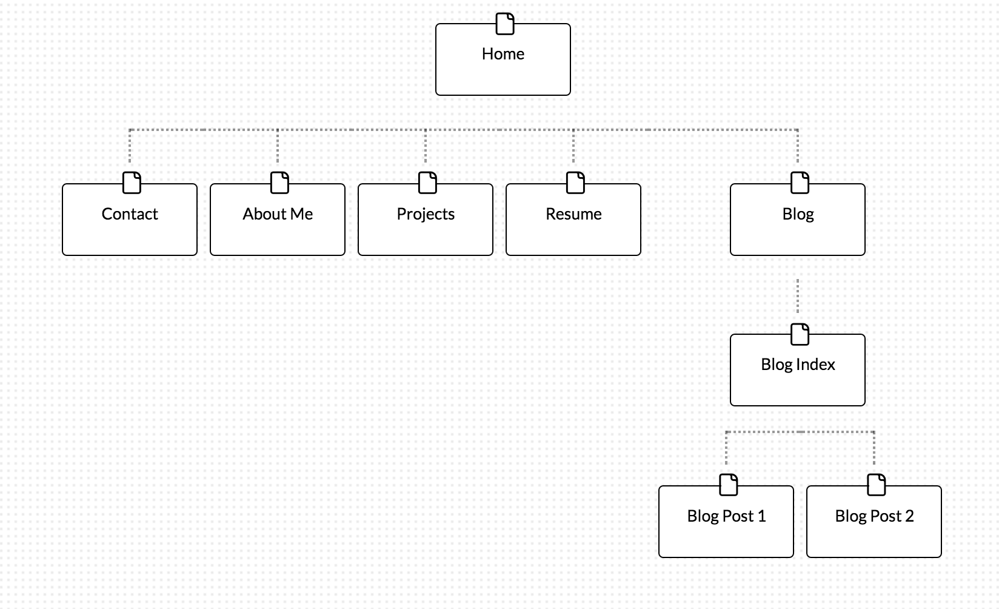

Site Map Reflection

What are the 6 Phases of Web Design?
The six phases of web design are 1)info gathering 2)planning 3)design 4)development 5)testing/delivery and 6)maintenance.

What is your site's primary goal or purpose? What kind of content will your site feature?
My site's primary goal is to showcase my dev bootcamp experience and progress as a developer.  I want my site to be able to list the projects that I am working on as well as my weekly blog posts.  Finally a personal bio, social media links and contact info.

What is your target audience's interests and how do you see your site addressing them?
My target audience would be interested in seeing what I've been working on during DBC, and I see my site addressing them with my portfolio section and blog.

What is the primary action the user should take when coming to your site? Do you want them to search for information, contact you, or see your portfolio? It's ok to have several actions at once, or different actions for different kinds of visitors.
The primary action the user should take when visiting my site would be to check out my portfolio/blog and to contact me.

What are the main things someone should know about design and user experience?

What is user experience design and why is it valuable?
UX is how someone interacts with a system, like a piece of software, app or website.  UX designers are interested in how users feel about these systems as they interact with them, focusing on efficiency and perception of value for their users.  It is valuable because the current level of saturation on the web with complex sites has raised the bar for UX...for a piece of software, app or website to be effective it MUST have great UX.

Which parts of the challenge did you find tedious?
For some reason I had a terribly difficult time adding my sitemap image to my sitemap-reflection.md file until I realized my relative path was completely off...whoops!