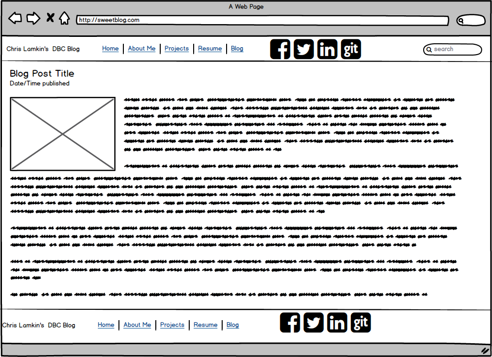
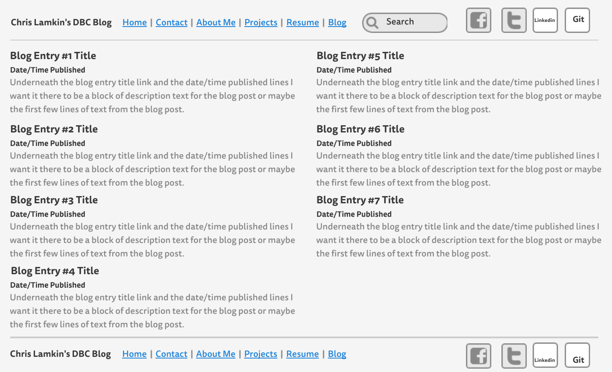

2.4 Release 4 Reflections

-What is a wireframe?
Wireframing is the first step in the web design, or screen design in general, process.  Basically you are creating a skeletal framework for a website.  It's important to establish the layout of your site to get a better idea of what you want it to look like, what features to include, etc. before you dive into the code.

-What are the benefits of wireframing?
Like I mentioned above, it's very beneficial to get an idea of what you want your site to look like before you code for it...that way you have a clear goal that you are working towards and a touchpoint that you can refer to as you are coding your site.

-Did you enjoy wireframing your site?
Once I found my preferred wireframing tools, balsamiq and mockingbird, I had a lot of fun building my site's layout.  While a blog seems incredibly simple, I had fun brainstorming what basic features I wanted to include and it was a lot of fun seeing what it would actually look like as opposed to just drawing up a to do list.

Did you revise your wireframe or stick with your first idea?
After I had my pairing session for wireframing the individual blog posts, I got a lot of new inspiration/ideas from my pairing partner...so I ended up going back and adding these features to my original wireframe.
What questions did you ask during this challenge? What resources did you find to help you answer them?

Wireframing had me think of a lot of questions about the code I would eventually use...for example I wanted a search bar and logically wanted to know what the html code was for creating a search bar, let alone getting it to actually work once it was displayed.  I think that's the beauty of wireframing, you add features that you may not know how to implement yet and then you can go back and research the code for these features...it keeps you super organized.

Which parts of the challenge did you enjoy and which parts did you find tedious?
I really enjoyed creating these mockups, I guess the only tedious part of it was creating a bunch of sample text for my individual blog posts in the index portion...it would have been a bit more fun creating the wireframes once these blog posts were already written so that I could be as specific as possible...but that's the nature of wireframing, setting the parameters for future work/blog posts.