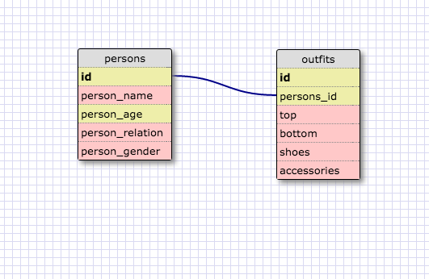

# Reflection

### What are databases for?
Databases help you store information.  In the past we have done this with arrays and hashes, but using SQL we can create databases with multiple structures that are much more easy to navigate.

### What is a one-to-many relationship?
A one-to-many relationship describes a relationship between two groups, say A and B where many of the items in group A belong to an item in group B.

### What is a primary key?  What is a foreign key? How can you determine which is which?
A primary key is a key in a relational database that is unique for each record.  For example, the state ID is unique for each state, and can be considered a primary key.  A foreign key is a column or field in one table that identifies a row from another table.  So the region_id field of the states table acts as a foreign key for the id field in the regions table.

### How can you select information out of a SQL database?  What are some general guidelines for that?
You can select information from an SQL database by using keywords like SELECT and FROM.  Following the select keyword, you list the fields that you want to access, which can be just one field, several, or all of them.After the keyword FROM you list the table that you are selecting fields from.  There are many other keywords that can help you organize or narrow down your selection, like WHERE, ORDER BY, GROUP BY, etc.  Make sure to include a semi-colon after your query though!