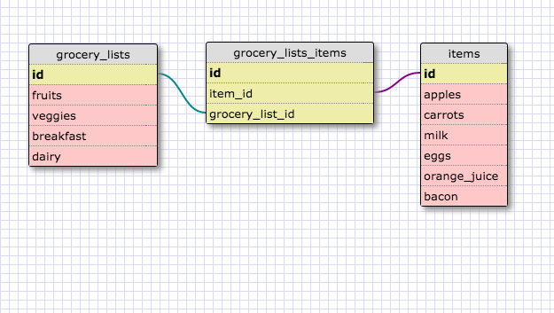

This schema shows a one-to-one relationship between soccer teams and their team captains.  Much like countries and capitals, a soccer club can have only one team captain at a time, so the two tables operate as a pair and are best represented by a one to one relationship.

### Reflection

###### What is a one-to-one database?
A one-to-one database has a one-to-one relationship, where two tables have a single relationship to one another, much like a pair.

###### When would you use a one-to-one database?
You would use this database whenever you have two tables that have a single relationship to one another...like countries and capitals.

###### What is a many-to-many database?
A many-to-many database has multiple tables that share many relationships with one another...they are connected by a join table that tracks each other tables IDs.

###### When would you use a many-to-many database?
You would use a many-to-many database whenever you have two tables that share many relationships with each other....for example with grocery lists and item lists, you can have many grocery lists that have many of the same items in each of them.

###### What is confusing about database schemas? What makes sense?
Foreign vs primary keys and how they interact was confusing at first, especially with many-to-many relationships, however after seeing the join table track each table's ID it started to make more sense to me.