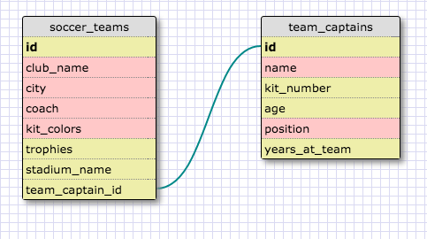

This schema shows a one-to-one relationship between soccer teams and their team captains.  Much like countries and capitals, a soccer club can have only one team captain at a time, so the two tables operate as a pair and are best represented by a one to one relationship.